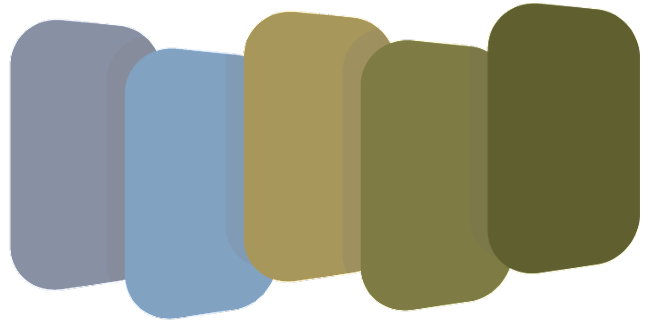

# What can CSDMS do for you?

An overview of CSDMS products, services, and events

> Mark Piper <small>mark.piper@colorado.edu</small>

<!-- s -->

# What is CSDMS?

<!-- v -->

CSDMS supports computational modeling in earth-surface science by engaging community, providing computing resources, and promoting education.

<!-- s -->

# Products

<!-- v -->

## CSDMS develops a system of software elements for building, coupling, and running models

### We call this system the *CSDMS Workbench*

<!-- v -->

# Basic Model Interface
## (BMI)

A standardized set of functions for controlling models.

> [bmi.csdms.io](https://bmi.csdms.io)

Note: I tried to make a pithy, one-sentence description for each product.

<!-- v -->

# Standard Names

Rules and patterns for creating specific and unambiguous variable names.

> [standard-names.readthedocs.io](https://standard-names.readthedocs.io)

Note: I intentionally made my slides boring so you have to listen to me.

<!-- v -->

# Babelizer

Wrap models exposing a Basic Model Interface in Python.

> [babelizer.readthedocs.io](https://babelizer.readthedocs.io)

<!-- v -->

# Python Modeling Toolkit
## (pymt)

A Python framework for running and coupling models with a Basic Model Interface.

> [pymt.readthedocs.io](https://pymt.readthedocs.io)

<!-- v -->

# Landlab

A Python toolkit for creating models.

> [landlab.csdms.io](https://landlab.csdms.io)

<!-- v -->

# Data Components

Datasets or data formats wrapped with a Basic Model Interface.

> [csdms.colorado.edu/wiki/DataComponents](https://csdms.colorado.edu/wiki/DataComponents)

<!-- v -->

The current list of data components:

* ERA5
* GeoTIFF
* GridMET
* NWIS
* SoilGrids
* OpenTopography
* WaveWatch III
* ROMS

For more on data components, see Gan *et al.* (2024): 
https://doi.org/10.5194/gmd-17-2165-2024.

Note: Would you like to contribute a data component? Let us know!

<!-- v -->

## How do these elements work together?

<!-- v -->

<!-- v -->

# Summary: Products

CSDMS develops software (the *CSDMS Workbench*) for building, coupling, and running models.

* Basic Model Interface (BMI)
* Standard Names
* Babelizer
* Python Modeling Toolkit (pymt)
* Landlab
* Data Components

See what's new at the [Software Release Dashboard](https://csdms.colorado.edu/wiki/SoftwareReleases).

<!-- s -->

# Services

<!-- v -->

## CSDMS offers research-enhancing services for its community members.

<!-- v -->

# Model Repository

A registry for >400 numerical models and scientific software tools.

> [csdms.colorado.edu/wiki/Model_download_portal](https://csdms.colorado.edu/wiki/Model_download_portal)

<!-- v -->

# Teaching Labs

A library of modular teaching labs that can augment undergrad/grad course material.

> [csdms.colorado.edu/wiki/Labs_portal](https://csdms.colorado.edu/wiki/Labs_portal)

<!-- v -->

# EarthscapeHub

A cloud-based computational platform for research, teaching, and software development.

> [csdms.colorado.edu/wiki/JupyterHub](https://csdms.colorado.edu/wiki/JupyterHub)

<!-- v -->

# Supercomputing

Access a state-of-the-art supercomputing resource for free.

> [csdms.colorado.edu/wiki/HPC](https://csdms.colorado.edu/wiki/HPC)

<!-- v -->

# Help Desk

Ask questions, get answers (about CSDMS products and services).

> [csdms.github.io/help-desk](https://csdms.github.io/help-desk)

<!-- v -->

# Office Hours

Bring your questions! We'll do the best we can to answer them.

> [csdms.colorado.edu/wiki/OfficeHours](https://csdms.colorado.edu/wiki/OfficeHours)

<!-- v -->

# Forum

Connect, share information, and discuss all things CSDMS.

> [forum.csdms.io](https://forum.csdms.io)

<!-- v -->

# RSEaaS

Do you need software development on a project? CSDMS can help.

> [csdms.colorado.edu/wiki/RSE](https://csdms.colorado.edu/wiki/RSE)

<!-- v -->

# Summary: Services

CSDMS offers research-enhancing services for its community members.

* Model Repository
* Teaching Labs
* EarthscapeHub
* Supercomputing
* Help Desk
* Office Hours
* Forum
* RSEaaS

<!-- s -->

# Events

<!-- v -->

## CSDMS holds in-person and remote events for its community members.

<!-- v -->

# Annual Meeting

See your favorite earth and planetary surface processes researchers, all in one place.

> [csdms.colorado.edu/wiki/Form:Annualmeeting2025](https://csdms.colorado.edu/wiki/Form:Annualmeeting2025)

<!-- v -->

# Webinars

Stay up to date on the latest research from community members.

> [csdms.colorado.edu/wiki/Webinars](https://csdms.colorado.edu/wiki/Webinars)

<!-- v -->

# ESPIn

An intensive course in numerical modeling \& best practices in scientific software development.

> [csdms.colorado.edu/wiki/ESPIn](https://csdms.colorado.edu/wiki/ESPIn)

<!-- v -->

# Roadshows

Let CSDMS come to your institution to talk about best practices in geoscientific software development.

> [csdms.colorado.edu/wiki/Roadshows](https://csdms.colorado.edu/wiki/Roadshows)

<!-- v -->

# Summary: Events

CSDMS holds in-person and remote events for its community members.

* Annual Meeting
* Webinars
* ESPIn
* Roadshows

<!-- s -->

# Summary

<!-- v -->

## CSDMS develops and manages a suite of products, services, and events with the goal of accelerating research in the Earth and planetary surface processes community

<!-- v -->

# What can CSDMS do for you?

<!-- s -->

# Thank you!

<!-- s -->

# What can CSDMS do for you?

An overview of CSDMS products, services, and events

> Mark Piper <small>mark.piper@colorado.edu</small>
